<div align="center">

# 🛡️ GigShield

### AI-Powered Parametric Insurance for Gig Workers

**Team Titan Edge · Guidewire DEVTrails 2026**

</div>

---

## 📌 Problem Statement

Gig workers — delivery partners, drivers, and couriers — depend entirely on daily earnings. External disruptions regularly stop them from working, with zero compensation:

| Disruption | Example | Daily Income Lost |
|---|---|---|
| 🌧️ Heavy Rain | Flooding in delivery zones | ₹800+ |
| 🌡️ Extreme Heat | 45°C+ unsafe conditions | ₹800+ |
| 🌫️ Severe Pollution | AQI 400+ air quality | ₹600+ |
| 🚧 Curfew / Strike | Area shutdowns | ₹800+ |
| 🚗 Traffic Lockdown | Severe congestion | ₹500+ |

> 💡 **Currently, there is no system that compensates this loss automatically.**

---

## 💡 Our Solution

**GigShield** is an AI-powered parametric insurance platform that:

- 🔮 **Predicts** disruption risks before they happen
- 📊 **Dynamically calculates** weekly premiums via AI
- 📡 **Monitors** real-world data — weather, traffic, government alerts
- ⚡ **Automatically triggers** payouts when thresholds are crossed
- 🔐 **Prevents fraud** using multi-layer verification

> ### ⚡ No claims. No delays. Instant protection.

---

## 🔁 How It Works

```
External Data ──► AI Risk Engine ──► Weekly Premium ──► Policy Activated
                                                               │
                                                               ▼
                                               Real-Time Monitoring
                                                               │
                                                    Threshold Crossed?
                                                    /              \
                                                  Yes              No
                                                   │                │
                                                   ▼          Keep Monitoring
                                            Fraud Check
                                           /           \
                                        Pass            Flag
                                          │               │
                                     Auto Payout    Manual Review
                                    (< 2 minutes)
```

---

## 📊 Weekly Premium Model

Premiums are dynamically calculated using a **Worker Risk Index (WRI)**:

```
Premium = Base Rate × Weather Multiplier × Zone Multiplier × Behavior Score × Demand Adjustment
```

| Factor | Range | Description |
|---|---|---|
| Base Rate | ₹25 | Fixed base |
| Weather | 0.8x – 2.0x | Rain, heat, AQI conditions |
| Zone | 0.7x – 1.5x | Risk level of worker's area |
| Behavior | 0.9x – 1.1x | Worker reliability history |
| Demand Adj. | 0.95x – 1.2x | Current market demand |

> 💰 **Final Premium Range: ₹15 – ₹80 per week**

---

## ⚡ Parametric Triggers

Payouts fire automatically the moment a threshold is crossed and the worker is in the affected zone:

| Trigger | Condition | Auto-Payout |
|---|---|---|
| 🌧️ Heavy Rain | Rainfall > 80 mm / 24 hrs | ₹400 |
| 🌡️ Extreme Heat | Temperature > 45°C | ₹300 |
| 🌫️ Severe Pollution | AQI > 300 | ₹350 |
| 🚧 Curfew / Strike | Government restriction active | ₹500 |
| 🚗 Traffic Lockdown | Severe congestion detected | ₹250 |

---

## 🧠 AI / ML Architecture

### 1. Disruption Prediction
- **Models:** LSTM + Random Forest
- **Output:** 48-hour disruption risk forecast per zone

### 2. Fraud Detection
- **Models:** Isolation Forest + Autoencoder
- **Detects:** Fake claims · Location spoofing · Data inconsistencies

### 3. Income Loss Estimation
- **Model:** Regression
- **Output:** Expected daily earnings loss per worker

### 4. Dynamic Pricing Engine
- **Models:** GLM + Reinforcement Learning
- **Output:** Real-time weekly premium adjustments

---

## 🏗️ Tech Stack

| Layer | Technology |
|---|---|
| **Mobile** | Flutter |
| **Web** | React.js |
| **Backend** | FastAPI · Kafka · Celery + Redis |
| **AI / ML** | PyTorch · Scikit-learn |
| **Database** | PostgreSQL · Redis · ClickHouse |
| **APIs** | OpenWeatherMap · Google Maps · CPCB / AQI · News API |
| **Payments** | Razorpay Sandbox · UPI Simulator |
| **DevOps** | Docker · Kubernetes · AWS / GCP |

---

## 🔐 Fraud Prevention

- 📍 GPS location verification
- 🌦️ Weather API cross-check against claims
- 🤖 Behavioral anomaly detection
- 🔁 Duplicate claim detection

---

## 📱 Key Features

### 👤 Worker Dashboard
- Active coverage status
- Weekly premium details
- Payout history

### 🛠️ Admin Dashboard
- Risk analytics and heatmaps
- Fraud alerts
- Claim statistics

---

## 📅 Development Roadmap

### ✅ Phase 1 — Ideation (Weeks 1–2)
- [x] Problem analysis and persona research
- [x] Solution architecture design
- [x] WRI premium formula definition
- [x] Parametric trigger design
- [x] README + 2-minute video

### 🔄 Phase 2 — Build (Weeks 3–4)
- [ ] Worker onboarding and registration
- [ ] Policy management system
- [ ] Parametric trigger engine (5 triggers)
- [ ] Basic worker and admin dashboards

### 🚀 Phase 3 — Scale (Weeks 5–6)
- [ ] Fraud detection system
- [ ] Instant UPI payouts
- [ ] AI model optimization
- [ ] Production-ready deployment

---



## 🎯 Why GigShield?

| Traditional Insurance | GigShield |
|---|---|
| Manual claim filing | Fully automated |
| Days to weeks for payout | < 2 minutes |
| Static pricing slabs | AI-based dynamic pricing |
| Limited disruption coverage | 5 real-world parametric triggers |
| No fraud intelligence | Multi-layer fraud detection |

---

## 🏁 Outcome

GigShield ensures:

- ✔️ Financial stability for gig workers during disruptions
- ✔️ Instant, automated compensation — no paperwork
- ✔️ AI-driven fair pricing based on real risk
- ✔️ Scalable model across cities and platforms


---

## 📌 Future Scope

- Direct integration with delivery platforms (Zomato, Swiggy, Amazon)
- Real-time earnings tracking via platform APIs
- Expansion to other gig sectors — domestic workers, freelancers, auto drivers

---

<div align="center">

*Protecting India's gig economy, one delivery partner at a time.*

</div>
